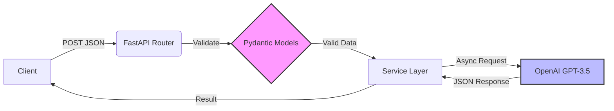

# 🚀 AI Interview Screener (Backend)


A high-performance, asynchronous backend service designed to automate the technical screening process. This microservice accepts candidate answers, utilizes an LLM for semantic evaluation, and ranks candidates concurrently.

---

## 📖 Table of Contents
- [System Architecture](#-system-architecture)
- [Project Structure](#-project-structure)
- [Key Features](#-key-features)
- [Installation & Setup](#-installation--setup)
- [API Reference](#-api-reference)
- [Design Decisions (The "Why")](#-design-decisions)
- [Future Roadmap](#-future-roadmap)

---

## 🏗 System Architecture

The application follows a **Service-Layer Pattern** to decouple business logic from the HTTP transport layer. The diagram below illustrates the asynchronous data flow.



## 📂Project Structure
```
/ai-interviewer-backend
│
├── app/
│   ├── main.py            # Application Entry Point & Routes
│   ├── models.py          # Pydantic Schemas (Strict Data Contracts)
│   ├── services.py        # Business Logic (LLM Integration & Ranking)
│   └── config.py          # Environment Configuration
│
├── tests/                 # Pytest Suite
├── Dockerfile             # Containerization
├── requirements.txt       # Dependencies
└── README.md              # Documentation
```
## ✨ Key Features
​🛡️ Strict Type Safety: Leverages Pydantic for rigorous request/response validation. Prevents "garbage in" data from reaching the logic layer.
​🎯 Deterministic AI Outputs: Utilizes OpenAI's response_format={"type": "json_object"} to guarantee the LLM returns parseable JSON, eliminating brittle regex parsing.
​⚡ High-Concurrency Ranking: The /rank-candidates endpoint uses asyncio.gather to process generic candidate batches in parallel.
​Impact: Latency is bounded by the slowest single request (O(1)), rather than the sum of all requests (O(n)).
​📦 Production Ready: Includes strict error handling, environment configuration via .env, and Docker containerization.
​🛠 Installation & Setup
​Prerequisites
​Python 3.9+
​Docker (Optional)
​OpenAI API Key
## 1.Clone the repository
git clone [https://github.com/Xzavior34/ai-interviewer-backend.git](https://github.com/Xzavior34/ai-interviewer-backend.git)
cd ai-interviewer-backend
## 2. Set up Environment
​Create a .env file in the root directory and add your key:
# .env
OPENAI_API_KEY=sk-your-actual-api-key-here
## 3. Install Dependencies
pip install -r requirements.txt
## 4. Run the Server
uvicorn app.main:app --reload
Server will start at http://localhost:8000
## ​🧠 Design Decisions
​1. Why FastAPI over Node.js?
​While Node.js is excellent for I/O-bound tasks, FastAPI was selected for specific architectural advantages:
​Data Integrity: The integration with Pydantic ensures that data contracts are enforced before code execution. In an API handling external AI inputs, validation is the first line of defense.
​Native AI Ecosystem: Python is the lingua franca of AI. If we need to expand this later to use LangChain, local HuggingFace models, or RAG (Retrieval Augmented Generation), Python libraries are superior.
​Async Performance: Python's modern async/await syntax handles the latency of LLM API calls just as efficiently as Node's Event Loop.
​2. Why GPT-3.5-Turbo + JSON Mode?
​Reliability: Generative models are notoriously difficult to parse programmatically. By enforcing json_object mode, we shift the burden of structure from the application logic to the model itself.
​Cost/Efficiency: For a screening task, GPT-4 is overkill. GPT-3.5-Turbo provides the optimal balance of reasoning capability and latency/cost.
##​🧪  Running Tests
​Quality assurance is handled via pytest. We prioritize testing validation logic and endpoint health.
pytest
## 🗺 Future Roadmap (Improvements)
​[ ] Rate Limiting: Implement slowapi to prevent API abuse.
​[ ] Database Integration: Persist candidate scores using PostgreSQL/SQLAlchemy.
​[ ] Caching: Use Redis to cache results for identical answers to save on API costs.
​Built with ❤️ by Philip Inem
